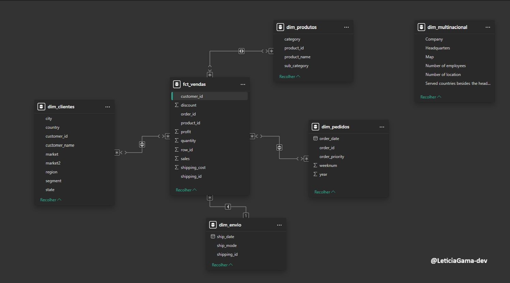

# Rota 01 – Estrutura de Dados

##  Introdução
O projeto **Rota 01 – Estrutura de Dados** tem como objetivo construir um sistema tabular relacional para a empresa **Super Store**, aplicando o processo **ETL (Extrair, Transformar e Carregar)**.  

A proposta é criar um conjunto de tabelas de fatos e dimensões que permita armazenar e consultar informações de forma eficiente, facilitando a análise de dados e a tomada de decisões estratégicas.  

O trabalho visa também introduzir os conceitos de estruturas de dados e modelagem dimensional, utilizando técnicas de ETL e organização em banco de dados relacional.

##  Tecnologias Utilizadas
- **Google BigQuery** – para criação e consulta das tabelas de fatos e dimensões  
- **Planilhas Google** – para extração e transformação de dados externos  
- **Python / Google Colab** – para web scraping (BeautifulSoup)  
- **SQL** – linguagem utilizada nas consultas e criação das tabelas  


##  Estrutura e Etapas do Projeto

### 1. Extração
- Importação dos dados originais da **Super Store**.  
- Pesquisa e extração de dados de concorrentes utilizando **IMPORTHTML** (Planilhas Google) ou **BeautifulSoup** (Python).

### 2. Transformação
- Identificação e tratamento de:
  - Valores **nulos** (identificados, mas não removidos);
  - **Duplicatas** (identificadas para evitar redundâncias nas tabelas);
  - **Inconsistências categóricas** (padronização de texto, formatação e uniformização);
  - **Inconsistências numéricas** (verificação de tipos incorretos).  
- Padronização dos dados antes da criação das tabelas de fatos e dimensões.

### 3. Carga
- Criação do modelo relacional no **BigQuery** com tabelas de **fatos** e **dimensões**:  
  - **Tabelas de Dimensões:** Contêm informações únicas e descritivas (clientes, produtos, regiões, modos de envio etc.).  
  - **Tabela de Fatos:** Contém métricas de negócio (vendas, lucro, quantidade, descontos) referenciadas pelos IDs das dimensões.  
- Escolha do **modelo estrela (Star Schema)**, que facilita consultas e análises no contexto de Business Intelligence.

### 4. Pipeline de Atualização
- Definição da sequência de atualização das tabelas, considerando dependências;  
  - Projeção de um **pipeline conceitual** de atualização diária dos dados.  


##  Códigos / Queries Relevantes

### 1. SQL – Criação das Tabelas de Dimensões

* **O que faz:** cria tabelas únicas para cada dimensão (clientes, produtos, regiões, modos de envio) com IDs exclusivos.

```sql
-- Exemplo: tabela dimensão Cliente
CREATE TABLE dimensao_cliente AS
SELECT DISTINCT
    customer_id AS cliente_id,
    customer_name,
    segment,
    city,
    state,
    country
FROM superstore_vendas;
```

### 2. SQL – Criação da Tabela Fato

* **O que faz:** cria tabela fato de vendas, referenciando os IDs das dimensões e agregando métricas de interesse.

```sql
-- Exemplo: tabela fato Vendas
CREATE TABLE fato_vendas AS
SELECT
    f.order_id,
    f.order_date,
    c.cliente_id,
    p.produto_id,
    r.regiao_id,
    f.quantity,
    f.sales,
    f.profit,
    f.discount
FROM superstore_vendas f
JOIN dimensao_cliente c ON f.customer_id = c.cliente_id
JOIN dimensao_produto p ON f.product_id = p.produto_id
JOIN dimensao_regiao r ON f.region = r.regiao_nome;
```

### 3. Python / Colab – Web Scraping de Concorrentes

* **O que faz:** extrai dados de concorrentes da Wikipedia e gera CSV para integração no BigQuery.

```python
import requests
from bs4 import BeautifulSoup
import pandas as pd

url = "https://pt.wikipedia.org/wiki/Lista_de_multinacionais"
resposta = requests.get(url)
soup = BeautifulSoup(resposta.text, 'html.parser')

# Localiza tabela e transforma em DataFrame
tabela = soup.find('table', {'class':'wikitable'})
df_concorrentes = pd.read_html(str(tabela))[0]

# Salva como CSV
df_concorrentes.to_csv('concorrentes.csv', index=False)
```

## Artefatos e Diagramas do Projeto

### 1. Visão Geral do Projeto
* Apresenta uma visão geral do projeto e do conjunto de dados.
* Função: Servir como introdução ao escopo do projeto.


### 2. Diagrama do Pipeline de ETL
* Esta imagem detalha a lógica e a ordem de execução do pipeline de dados, planejado para uma implementação futura.
* Função: Definir o fluxo de automatização para a atualização das tabelas, garantindo a integridade e a concorrência dos dados.


### 3. Star Schema (Modelo Estrela)
* O que mostra: modelo de tabela fato e tabelas de dimensões da Super Store.
* Objetivo: demonstra a estrutura de dados que sustenta todas as análises e dashboards, mostrando os relacionamentos 1:N entre dimensões e a tabela fato.



## Resultados e Conclusões

### Resultados Obtidos
O principal resultado deste projeto foi a **transformação de dados brutos e desestruturados em um Data Warehouse relacional, limpo e modelado**, pronto para consumo analítico.
* **Modelo Estrela (Star Schema):** Foi implementado um modelo com uma Tabela Fato central (vendas) conectada a múltiplas Tabelas de Dimensões (clientes, produtos, regiões, etc.), otimizado para consultas de BI.
* **Dados Limpos e Padronizados:** As inconsistências categóricas foram corrigidas, valores nulos e duplicatas foram identificados, garantindo a integridade dos dados.
* **Integração de Dados Externos:** O processo de web scraping enriqueceu o dataset original com dados de concorrentes, permitindo análises de mercado mais robustas.
* **Pipeline Conceitual:** Foi desenhado um fluxo de atualização (pipeline) que define a ordem correta de carga (Dimensões primeiro, Fato depois) para garantir a integridade referencial.

### Conclusões e Valor de Negócio
A estruturação dos dados realizada neste projeto não é um fim em si, mas um **facilitador estratégico** crucial.
1. **Base para BI (Business Intelligence):** Este projeto criou a fundação essencial para análises de BI. Sem um modelo dimensional limpo, ferramentas como Power BI (usadas na Rota 02) não conseguiriam gerar insights confiáveis ou teriam performance muito baixa.
2. **Otimização de Consultas:** A estrutura em Star Schema otimiza drasticamente o desempenho de consultas analíticas complexas, permitindo que analistas e gestores obtenham respostas mais rapidamente.
3. **Confiabilidade e "Fonte Única da Verdade":** Ao limpar e centralizar os dados, este Data Warehouse se torna a "fonte única da verdade" (Single Source of Truth), garantindo que todos na empresa baseiem suas decisões nos mesmos números.
4. **Escalabilidade:** O pipeline conceitual e o modelo relacional permitem que a empresa adicione novas fontes de dados ou mais registros históricos de forma organizada e escalável.


##  Como Rodar o Projeto

### 1. BigQuery – Criação de Tabelas e ETL
1. Acesse o **Google BigQuery** e conecte-se ao dataset da **Super Store**.  
2. Importe a tabela de vendas da Super Store.  
3. Execute consultas SQL para:
   - Identificar valores nulos e duplicados;  
   - Padronizar variáveis categóricas;  
   - Validar consistência de variáveis numéricas.  
4. Modele e crie as **tabelas de dimensões** (clientes, produtos, regiões, modos de envio, etc.) com IDs únicos.  
5. Crie a **tabela fato** contendo métricas de vendas, lucro, quantidade e desconto, referenciando os IDs das dimensões.  
6. Projete o **pipeline conceitual de atualização de dados**, definindo a ordem de atualização entre as tabelas (dimensões antes da fato).

### 2. Python / Google Colab – Web Scraping

1. Abra o notebook disponível em [ROTAS01_ETL.ipynb](notebooks/ROTAS01_ETL.ipynb).
2. Execute o script Python para extrair dados de concorrentes da Wikipedia utilizando BeautifulSoup.
3. Os dados extraídos serão transformados em CSV e importados para BigQuery, integrando-se à estrutura de tabelas criada.

### Observações
- A tabela da Super Store é fictícia, enquanto a tabela de concorrentes foi obtida via web scraping do site Wikipedia.
- A limpeza realizada foi **conceitual**, voltada à padronização e estruturação dos dados para consultas.
- Não foram inseridos dados novos nem removidos valores nulos — apenas identificados e tratados para padronização.
- Para reproduzir o projeto, basta seguir a sequência acima no BigQuery e executar o notebook de Python.

## Autor
**Leticia Gama de Souza**  
[LinkedIn](https://www.linkedin.com/in/leticia-gama-code) | [GitHub](https://github.com/LeticiaGama-dev)
